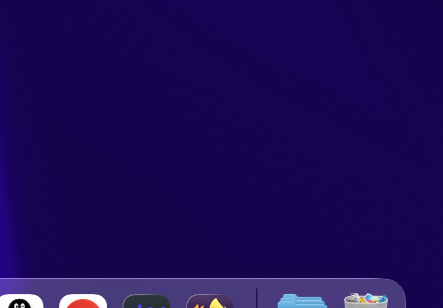

# Command Code Desktop Widget

> macOS 桌面悬浮窗，实时监控你的 Command Code API 用量。

一个原生 SwiftUI 编写的纯玻璃质感小部件，贴在桌面上显示你的 token 消耗、费用和模型使用分布。灵感来自 Apple Screen Time 的简洁设计。



## 功能

- **实时用量监控** — Cost / Tokens / Runs / Success Rate 一目了然
- **模型分色柱状图** — DeepSeek-V4-Pro、DeepSeek-V4-Flash、K2.5、K2.6、MiniMax，各色一根柱子
- **Hover tooltip** — 悬停柱子查看该小时各模型详细用量
- **玻璃材质** — ultraThinMaterial（桌面/玻璃质感）+ regularMaterial（点击时不透明）
- **拖拽吸附** — 24px 网格对齐，拖动时有白色高亮框提示
- **右键菜单** — 刷新数据 / 退出
- **自动刷新** — 每 30 分钟 + 回到桌面自动刷新
- **余额显示** — 绿色/橙色指示灯 < $1

## 系统要求

- macOS 26+
- Firefox 浏览器（需已登录 [commandcode.ai](https://commandcode.ai)）
- Xcode Command Line Tools（`swiftc`）

## 快速开始

```bash
# 1. Clone
git clone https://github.com/MitoroMisaka/commandcode-desktop-widget.git
cd commandcode-desktop-widget

# 2. Build
./build.sh

# 3. Launch
open .build/CC.app
```

## 构建

不需要 Xcode GUI，纯 `swiftc` 命令行：

```bash
swiftc -sdk "$(xcrun --sdk macosx --show-sdk-path)" \
  -target arm64-apple-macos26.0 \
  -framework SwiftUI -framework AppKit -framework Combine -framework Foundation \
  -O \
  -o .build/CommandCodeWidget \
  Sources/Models.swift \
  Sources/TokenExtractor.swift \
  Sources/DataFetcher.swift \
  Sources/App.swift
```

## 工作原理

### 数据来源

Widget 从 Command Code 的内部 API 拉取数据，这些端点同样被 [commandcode.ai/studio](https://commandcode.ai/studio) 使用：

| 端点 | 内容 |
|------|------|
| `/internal/usage/summary` | 总用量摘要（cost/tokens/runs/successRate） |
| `/internal/usage/charts` | 按小时分桶的逐模型用量数据 |
| `/internal/billing/credits` | 月末余额 |

### Cookie 认证

Widget 自动从 Firefox 的 cookie 数据库读取会话 token。确保 Firefox 已登录 `commandcode.ai`。

默认 Firefox profile 为 `7wpm1h7n.default-release`——如果不同，请修改 `Sources/TokenExtractor.swift` 的 `dbPath`：

```swift
static let dbPath = NSHomeDirectory() + "/Library/Application Support/Firefox/Profiles/<你的profile>/cookies.sqlite"
```

### 显示逻辑

- API 返回的 UTC 时间戳自动转换为 JST（东九区）显示
- 柱状图最多显示最近 10 个小时的数据
- 数据按模型分色堆叠，悬停查看详细分布

## 同类项目对比

| 项目 | 平台 | 目标服务 |
|------|------|----------|
| `chillikai/claude-usage-widget` | macOS 菜单栏 | Claude API |
| `croustibat/ClaudeWidget` | macOS 桌面 | Claude API |
| `lkltxwd001/deepseek-desktop-widget` | macOS 桌面 | DeepSeek API |
| **本项目** | macOS 桌面 | **Command Code** |

这是首个 Command Code 桌面用量监控工具。

## 许可证

MIT
